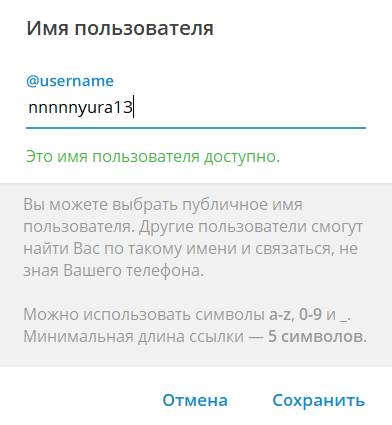

# Инструкция по изменению имени пользователя в Telegram Desktop
1. Открыть приложение [Telegram Desktop](https://desktop.telegram.org/?setln=ru).
----
2. Войти в аккаунт.
----
3. Нажать на иконку "Бургер" в левой панели управления.

    
----
4. Выбрать пункт меню "Мой профиль".

    
----
5. Нажать на иконку "Карандаш" в правом верхнем углу.

    
----
6. Выбрать пункт "Имя пользователя".

    
----
7. Изменить имя пользователя согласно требованиям.

    
----
8. Сохранить изменения.
----
